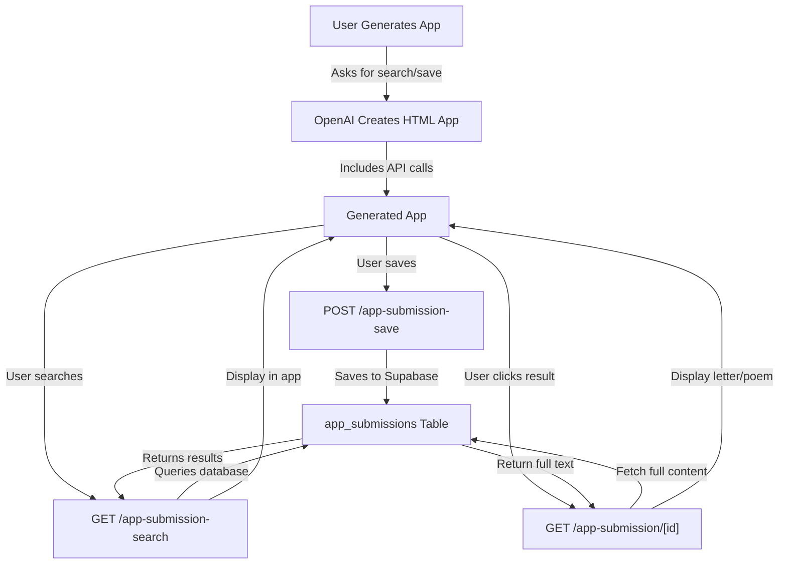

# Build the Damn Thing - Database & Search Implementation

## Overview

The "Build the Damn Thing" feature now supports **persistent database storage and dynamic search** for generated apps. When you ask the app to save and search items (like letters, poems, messages), it will:

1. **Save** submissions to a Supabase database (not just localStorage)
2. **Search** by name and location across all submissions
3. **Retrieve** full content for reading

---

## Architecture

### Database Schema

**Table: `app_submissions`**

```sql
- id (UUID) - Unique identifier
- app_name (TEXT) - Name of the generated app
- app_idea (TEXT) - The app's purpose
- name (TEXT) - Submitter's name (e.g., grandparent's name)
- location (TEXT) - Location (e.g., "Portland, Oregon")
- submission_type (TEXT) - Type (letter, poem, message, etc.)
- content (TEXT) - Full content
- created_at (TIMESTAMP) - When submitted
- search_name / search_location (GENERATED) - For fast searching
```

### API Endpoints

#### 1. **Save Submission**
```
POST /api/hub/app-submission-save
```

**Request:**
```json
{
  "appName": "GrandLetters",
  "appIdea": "Write letters to grandkids",
  "name": "Margaret Johnson",
  "location": "Portland, Oregon",
  "submissionType": "letter",
  "content": "Dear grandchild, ..."
}
```

**Response:**
```json
{
  "success": true,
  "id": "uuid-here",
  "message": "Submission saved successfully"
}
```

#### 2. **Search Submissions**
```
GET /api/hub/app-submission-search?appName=GrandLetters&name=Margaret&location=Portland&type=letter&limit=20
```

**Response:**
```json
{
  "success": true,
  "results": [
    {
      "id": "uuid-here",
      "name": "Margaret Johnson",
      "location": "Portland, Oregon",
      "submissionType": "letter",
      "preview": "Dear grandchild, I wanted to write...",
      "createdAt": "2026-04-17T10:30:00Z"
    }
  ],
  "total": 1
}
```

#### 3. **Get Full Submission**
```
GET /api/hub/app-submission?id=uuid-here
```

**Response:**
```json
{
  "success": true,
  "submission": {
    "id": "uuid-here",
    "appName": "GrandLetters",
    "name": "Margaret Johnson",
    "location": "Portland, Oregon",
    "submissionType": "letter",
    "content": "Dear grandchild, I wanted to write to you today...",
    "createdAt": "2026-04-17T10:30:00Z"
  }
}
```

---

## Generated App Implementation

When you generate an app with search/save features, the OpenAI prompt will instruct it to:

### For SAVE Feature:
```javascript
async function saveSubmission(name, location, content) {
  const response = await fetch('/api/hub/app-submission-save', {
    method: 'POST',
    headers: { 'Content-Type': 'application/json' },
    body: JSON.stringify({
      appName: 'GrandLetters',           // Your app name
      appIdea: 'Write letters...',       // Your app idea
      name: name,
      location: location,
      submissionType: 'letter',
      content: content
    })
  })
  
  const data = await response.json()
  if (data.success) {
    alert('Saved! ID: ' + data.id)
  }
}
```

### For SEARCH Feature:
```javascript
async function searchSubmissions(name, location) {
  const params = new URLSearchParams({
    appName: 'GrandLetters',
    name: name || '',
    location: location || '',
    limit: 20
  })
  
  const response = await fetch('/api/hub/app-submission-search?' + params)
  const data = await response.json()
  
  if (data.success) {
    // Display results with data.results array
    displayResults(data.results)
  }
}
```

---

## Setup Steps

### Step 1: Create Database Table

Run this SQL migration on your Supabase database:

```bash
# Copy the contents of CREATE_APP_SUBMISSIONS_TABLE.sql
# Go to Supabase → Your Project → SQL Editor
# Paste and execute
```

Or run via terminal:
```bash
# Using psql
psql postgresql://[user]:[password]@[host]/[database] < CREATE_APP_SUBMISSIONS_TABLE.sql
```

### Step 2: Verify Environment Variables

Ensure these are set in your Netlify environment:
```
NEXT_PUBLIC_SUPABASE_URL=https://your-project.supabase.co
NEXT_PUBLIC_SUPABASE_ANON_KEY=your-anon-key
```

### Step 3: Deploy Updated Code
```bash
# Push changes to GitHub main branch
git add .
git commit -m "Add database storage and search for generated apps"
git push origin main

# Netlify will auto-deploy
```

---

## Testing

### Automated Test Suite

Run the comprehensive test:
```bash
node test-build-the-damn-thing-db-search.mjs
```

This will:
1. ✅ Save a single submission
2. ✅ Save multiple submissions
3. ✅ Search by name
4. ✅ Search by location
5. ✅ Search by type
6. ✅ Get full submission content
7. ✅ Perform combined searches

### Manual End-to-End Test

1. **Generate an app** with search/save features:
   ```
   App Idea: "Letters from grandparents to grandkids"
   Answers should mention: "search", "find", "write", "save"
   ```

2. **Test Save Feature:**
   - Enter name: "Margaret Johnson"
   - Enter location: "Portland, Oregon"
   - Write a letter
   - Click "Save"
   - Should see success message with ID

3. **Test Search Feature:**
   - Go to "Search" tab
   - Search by name: "Margaret"
   - Should find the letter
   - Search by location: "Portland"
   - Should find the letter
   - Click to view full content

4. **Verify in Database:**
   - Go to Supabase dashboard
   - Check `app_submissions` table
   - Should see your submission(s)

---

## How It Works End-to-End



---

## Key Features

✅ **Persistent Storage** - Data survives page refreshes and user sessions  
✅ **Cross-User Search** - Users can find submissions from other users  
✅ **Fast Searching** - Indexed by name and location for performance  
✅ **Type Filtering** - Find by letter, poem, or other types  
✅ **Public Read Access** - Anyone can search (RLS allows public SELECT)  
✅ **Secure Write** - Only app submissions, no authentication required  
✅ **Immutable Records** - No delete/update to prevent data loss  

---

## Example: Grandparent Letter App

### User Flow

1. **Create Tab**: Grandparent writes a letter
   - "Your Name" → "Margaret Johnson"
   - "Your Location" → "Portland, Oregon"
   - Content → Letter text
   - Clicks "Save" → Stored in database

2. **Search Tab**: Grandkid searches for letters
   - Searches by name "Margaret" → Finds letter
   - Searches by location "Portland" → Finds letter
   - Clicks letter → Reads full content

3. **Share**: Generate a link to this specific letter
   - ID: `abc123def456`
   - URL: `https://app.netlify.app?letter=abc123def456`

---

## Troubleshooting

### "Database not configured" Error
**Solution:** Check `NEXT_PUBLIC_SUPABASE_URL` and `NEXT_PUBLIC_SUPABASE_ANON_KEY` in Netlify environment settings

### "Table doesn't exist" Error
**Solution:** Run `CREATE_APP_SUBMISSIONS_TABLE.sql` on your Supabase database

### No Search Results
**Check:**
1. Is data actually saved? Check Supabase dashboard
2. Are you searching the correct app name?
3. Try searching without name/location filters to see all results

### Performance Issues with Large Datasets
**Solution:** The table has indexes on `app_name`, `search_name`, and `search_location`. Add more if needed:
```sql
CREATE INDEX idx_app_submissions_combined 
ON app_submissions(app_name, search_name, search_location);
```

---

## Future Enhancements

- [ ] Add pagination for large result sets
- [ ] Add email notifications when new submissions arrive
- [ ] Add comment/reply feature
- [ ] Add user authentication (optional, for privacy)
- [ ] Add export to PDF
- [ ] Add sharing with specific recipients
- [ ] Add full-text search (more sophisticated)

---

## Files Modified/Created

**New Files:**
- `CREATE_APP_SUBMISSIONS_TABLE.sql` - Database migration
- `src/pages/api/hub/app-submission-save.ts` - Save endpoint
- `src/pages/api/hub/app-submission-search.ts` - Search endpoint  
- `src/pages/api/hub/app-submission.ts` - Detail endpoint
- `test-build-the-damn-thing-db-search.mjs` - Test suite

**Modified Files:**
- `src/pages/api/hub/build-and-deploy.ts` - Updated OpenAI prompt to use APIs

---

## Support

For issues or questions, check:
1. Supabase logs: Dashboard → Logs
2. Netlify logs: Dashboard → Deploys → Logs
3. Browser console: F12 → Console tab
4. Network tab: F12 → Network tab (check API responses)
